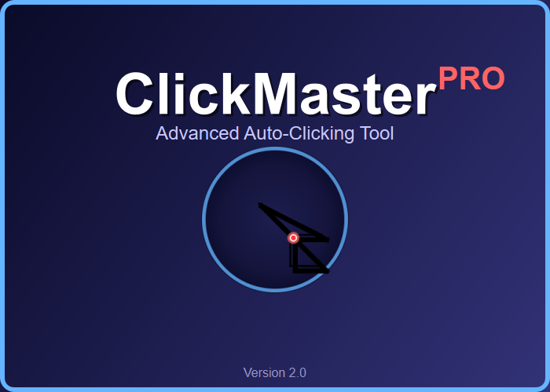

# Getu Clicker

A professional auto-clicking tool developed by Mario M.



## Features

- Multiple position clicking support
- Sequential or simultaneous clicking modes
- Configurable click interval (0.05 to 5 seconds)
- Duration setting for auto-stopping
- Keyboard shortcuts (F6 to toggle, Esc to stop)
- Mobile-responsive interface with scrolling support
- Browser automation for controlling multiple Chrome instances (NEW!)
- Session recording and playback for browser automation (NEW!)

## Installation

### Option 1: Download the Executable (Recommended)

1. Download the latest release from the [Releases](https://github.com/mariom/getuclicker/releases) page
2. Extract the ZIP file
3. Run `GetuClicker.exe` (Windows) or `GetuClicker` (macOS/Linux)

### Option 2: Run from Source

1. Clone the repository: `git clone https://github.com/mariom/getuclicker.git`
2. Navigate to the project directory: `cd getuclicker`
3. Install the dependencies: `pip install -r requirements.txt`
4. Run the application: `python main.py`

### Option 3: Build from Source

1. Clone the repository: `git clone https://github.com/mariom/getuclicker.git`
2. Navigate to the project directory: `cd getuclicker`
3. Run the build script: `python build.py`
4. The executable will be in the `dist` folder

## Usage

1. **Select Positions**: Click the "Select Positions" button and click on the screen where you want clicks to occur. Press Enter to confirm.
2. **Configure Settings**:
   - Set the click interval (time between clicks) using the slider
   - Set the duration (how long to run) in minutes (0 = indefinite)
   - Toggle "Multi-click Mode" to click all positions simultaneously
3. **Start/Stop Clicking**:
   - Click the "Start" button or press F6 to begin
   - Click the "Stop" button, press F6 again, or press Esc to stop

## Keyboard Shortcuts

- **F6**: Start/Stop clicking
- **Esc**: Emergency stop (works even when the app is in the background)
- **Enter**: Confirm position selection
- **F8**: Exit application

## Browser Automation (New!)

The browser automation feature allows you to control multiple Chrome browser instances independently, performing different actions in each browser simultaneously.

### Setup

1. Install Selenium: `pip install -r browser_requirements.txt`
2. Make sure you have Chrome installed on your system
3. Run the browser automation script: `python browser_automation.py --example`

### Features

- Control multiple Chrome instances simultaneously
- Execute different tasks in each browser
- Perform complex browser operations (clicks, form filling, navigation)
- Threaded or async execution modes
- Support for headless operation (with the `--headless` flag)
- Record and replay browser sessions (NEW!)

### Command-line Options

```
python browser_automation.py --help
```

#### Browser Configuration:
- `--browsers`, `-b`: Number of browser instances to create (default: 3)
- `--headless`: Run browsers in headless mode

#### Action Selection:
- `--example`: Run the example automation script
- `--replay FILE`: Replay a recorded browser session from a file

#### Recording Options:
- `--record`: Record browser sessions (default: enabled)
- `--no-record`: Disable session recording
- `--recording-dir DIR`: Directory to store recordings (default: browser_recordings)
- `--auto-replay`: Automatically replay the recorded session after completion
- `--list-recordings`: List all available recorded sessions

### Recording and Playback

The browser automation module now includes session recording and playback capabilities:

1. **Recording**: By default, all browser actions are recorded when you run the example:
   ```
   python browser_automation.py --example
   ```

2. **Listing Recordings**: View all available recordings:
   ```
   python browser_automation.py --list-recordings
   ```

3. **Replaying**: Replay a specific recording:
   ```
   python browser_automation.py --replay browser_session_20250404_123456.json
   ```
   
4. **Auto-Replay**: Record a session and immediately replay it:
   ```
   python browser_automation.py --example --auto-replay
   ```

5. **Headless Replay**: Replay a session without visible browsers:
   ```
   python browser_automation.py --replay FILENAME --headless
   ```

The recording system captures all browser actions, including navigation, clicks, form filling, and scrolling, making it possible to reproduce complex automation sequences.

## Requirements

- Windows, macOS, or Linux
- Python 3.8+ (if running from source)
- Required packages for core application:
  - customtkinter
  - pyautogui
  - pynput
  - pillow
- Required packages for browser automation:
  - selenium

## License

© 2025 Mario M. All rights reserved. 